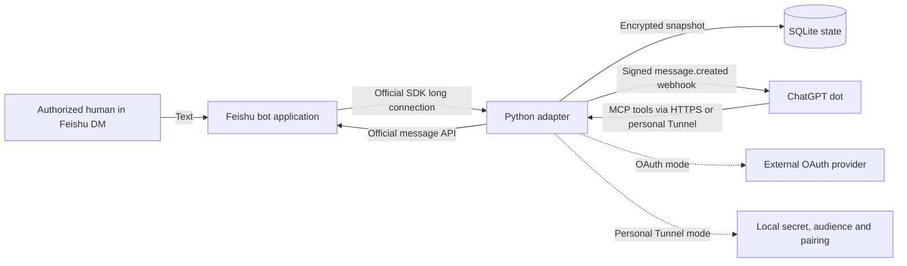

# dots-feishu-adapter

[English](README.md) | [简体中文](README.zh-CN.md)

Connect **ChatGPT dots** to one person's Feishu private chat through MCP tools and webhook events. This self-hosted Python adapter forwards authorized incoming text to a dot and lets it send or reply through the official Feishu SDK. The AI runs in the connected agent; the adapter does not run a model or depend on OpenClaw.

Dots are the primary integration target. Other MCP agents are potential clients only if they implement this adapter's exact transport, authentication and event contract; compatibility has not been verified with them.

## Version and verification status

This README describes public `main` at [`1164cef`](https://github.com/noir-hedgehog/dots-feishu-adapter/commit/1164cef7ddf95fef1dfbc6fb8bf3b815450615be), after [PR #1](https://github.com/noir-hedgehog/dots-feishu-adapter/pull/1) was merged. Status checked on **2026-10-07**. Source availability, offline verification and live deployment are separate states.

| Capability | Public `main` | Verification boundary |
| --- | --- | --- |
| Authorized private-chat text → `message.created`; text send/reply | Included | Offline protocol, SDK and persistence tests |
| OAuth-protected HTTP endpoint and encrypted state | Included | Real local JWT signatures and encryption, simulated network; no real provider/client exchange tested for this revision |
| Personal Secure MCP Tunnel, manual pairing and exact callback approval | Included, opt-in | Offline authentication, binding, callback and renewal coverage; current revision not validated against a live dot/Tunnel deployment |
| Retained inbox and message diagnostics | Included | OAuth and personal Tunnel HTTP read regressions passed, including rejected/revoked authorization |
| Durable `Get` receipt reactions | Included, opt-in in personal Tunnel mode | Offline queue, restart, scope and official SDK builder tests; live permissions/rendering need deployment checks |
| Fixed test image, rich-text link post and noninteractive card tools | Not included | Unpublished candidate work, not a supported feature of public `main` |
| Inbound image/file/audio attachment reading | Not included | Unpublished candidate work; no public media or transcription support claimed |

The merged implementation passed **119 offline tests with zero errors and zero skips** using its locked dependencies. Real OAuth integration, live Feishu permissions/delivery/reactions, live dot subscription/renewal and Linux service deployment were not exercised for this revision. Historical checks of an earlier personal deployment do not establish compatibility for every dot, tenant or MCP client. Other agents and Lark-region deployments remain unverified.

“Media candidates” means separate work on attachment byte delivery and file-text extraction, plus fixed outbound test messages. Receiving audio bytes does not itself transcribe speech or prove that a client can consume audio. These candidates are outside this README's supported interface and are not included in a clone of the current `main`.

## Architecture



The Feishu long connection receives messages without a public Feishu event receiver. The agent connects through an HTTPS MCP endpoint or the opt-in Secure MCP Tunnel; the adapter needs outbound HTTPS access to the agent's approved callback endpoint. A webhook acknowledgement confirms receipt of an event; a reply is a separate tool call.

| File | Responsibility |
| --- | --- |
| [`adapter.py`](adapter.py) | Single-human/chat policy, event subscriptions, callback signatures, deduplication and text tools; standalone server is mock-only |
| [`deploy/transport.py`](deploy/transport.py) | Stateless HTTP JSON binding, request metadata/headers, OAuth challenge and origin checks |
| [`deploy/auth.py`](deploy/auth.py) | External OAuth JWT validation and active-token introspection |
| [`deploy/store.py`](deploy/store.py) | Fernet-encrypted SQLite snapshot; durable subscriptions, queued events, message associations and send results |
| [`deploy/network.py`](deploy/network.py) | Approved HTTPS hosts, public DNS destinations, connection IP pinning and TLS hostname verification; no redirects |
| [`deploy/feishu.py`](deploy/feishu.py) | Official `lark-oapi` receive/send/reply integration and delivery worker |
| [`deploy/run.py`](deploy/run.py) | Explicit live startup, protected credentials and local HTTP listener |
| [`deploy/tunnel.py`](deploy/tunnel.py), [`deploy/tunnel_runtime.py`](deploy/tunnel_runtime.py) | Opt-in personal authentication, manual pairing, exact callback approvals and runtime |
| [`deploy/handoff.py`](deploy/handoff.py) | Opt-in bounded wait for approval of the original callback request |
| [`deploy/receipts.py`](deploy/receipts.py) | Durable asynchronous `Get` receipt queue with no automatic ambiguous retries |
| [`deploy/observability.py`](deploy/observability.py) | Allowlisted operational logs and aggregate health metrics |

## What `main` exposes

- Event: `message.created`, restricted to the configured human sender in the configured private chat; text only.
- `send_message`: send text to that chat.
- `reply_to_message`: reply to an inbound message already retained by this adapter.
- `list_received_messages`: read retained incoming text, oldest first, with `limit` (1–50, default 20), `cursor` and timezone-aware `since` filters. Timestamps are adapter receipt times; legacy records can have null timestamps.
- `get_message_status`: inspect one retained message's durable receipt, webhook, reply and `Get` reaction outcomes without returning its text or secrets.
- `events/list`, `events/subscribe` and `events/unsubscribe`: discover and manage webhook subscriptions.

Both write tools require `chat_id`, `text` and `idempotency_key`; replies also require `message_id`. These are schema field names, not values to copy from another deployment. Tool text is limited to 8,000 characters and the idempotency key to 128 characters. Group traffic, other senders/chats, bot-originated messages and non-text messages are rejected. The read tools require `chat_id`; status also requires `message_id`. Every HTTP call is authenticated. OAuth reads use the verified request principal; personal Tunnel reads additionally recheck the local audience and pairing. The inbox reads local retained state only: there is no provider-history fetch.

### Client compatibility

The deployed HTTP binding advertises protocol version `2026-07-28`. Clients must support its `server/discover` flow, per-request protocol/capability metadata, matching `Mcp-Protocol-Version` and `Mcp-Method` headers, and `Mcp-Name` on tool calls. Requests must advertise both JSON and event-stream response types, although this implementation returns JSON.

A generic “supports MCP” claim is insufficient: `main` has no stdio transport, legacy `initialize` HTTP handshake, SSE stream, sampling or elicitation support. A tools-only client cannot receive incoming messages unless it also implements the webhook event subscription and signed challenge flow. Other MCP agents and Lark-region deployments remain unverified. Check the actual client's supported version, authorization flow and event support before deploying.

## Local verification

Use Python 3.11 or later in an isolated environment:

```sh
git clone https://github.com/noir-hedgehog/dots-feishu-adapter.git
cd dots-feishu-adapter
python3 -m venv .venv
.venv/bin/python -m pip install -r requirements.lock.txt
.venv/bin/python verify.py
.venv/bin/python demo.py
.venv/bin/python -m deploy.run
```

`verify.py` runs the offline suite and treats skipped tests as failures. The implementation at `1164cef` was verified with 119 passing tests and zero skips, covering SDK builders, real local encryption/JWT signatures, simulated OAuth introspection, personal Tunnel authorization, callbacks, deduplication, receipts and deployment configuration. The demo uses mocks. Running `deploy.run` without `--run` checks dependencies and does not open ports or start network connections. These checks do not establish a live Feishu/dot session. The lockfile records tested versions; review dependency updates before deployment.

## Deployment and permissions

### Shared prerequisites

Confirm the target dot/client can connect the plugin, subscribe to webhook events and invoke the tools. The adapter cannot supply missing client capabilities. Create a Feishu bot application, enable its SDK long-connection subscription to `im.message.receive_v1`, grant private-message receive and bot send/reply permissions, and make the application available to the intended user. Verify current grants and tenant approval/publishing requirements using the official [receive](https://open.feishu.cn/document/server-docs/im-v1/message/events/receive), [send](https://open.feishu.cn/document/server-docs/im-v1/message/create) and [reply](https://open.feishu.cn/document/server-docs/im-v1/message/reply) references and the app console. Application permissions do not replace the adapter's single-human/chat checks.

Text messaging does not require media or group-history access. Optional `Get` reactions additionally require the app's reaction-write permission; see [receipt setup and limits](ops/RECEIPTS.md). The adapter does not grant permissions automatically. A reaction means durable adapter receipt, not completion of the dot's task.

Keep the state directory owner-only (`0700`) and its database owner-only (`0600`). Preserve the same Fernet key across restarts: a new key cannot decrypt existing state. Credentials and private configuration belong outside Git. Examples contain placeholders; supply your own identifiers and approved endpoints.

### Option A: OAuth (default)

1. Host `/mcp` and `/.well-known/oauth-protected-resource` behind an appropriate TLS reverse proxy or tunnel. The bundled local WSGI listener is not a standalone public production server.
2. Configure an external OAuth provider compatible with the client. This repository is a protected resource, not an authorization server.
3. Copy [`deploy/config.example.json`](deploy/config.example.json) to `deploy/config.local.json`. Fill in the resource URL, issuer, JWKS/introspection URLs, exact authorized subject and Feishu user/chat/app identifiers, approved callback hosts and allowed browser origins.
4. Start explicitly after configuration. The command prompts for the state key, Feishu App Secret and separate introspection resource-server credential:

   ```sh
   .venv/bin/python -m deploy.run --config deploy/config.local.json --run
   ```

The implementation requires RS256 JWTs with the configured issuer, resource audience, exact subject and `feishu:chat` scope. JWT and introspection claims must be active with no more than one hour remaining. JWKS and introspection endpoints must share the issuer's host; introspection uses a separate Bearer credential and must return the identity, scope and expiry claims checked by the adapter. These are implementation constraints, not universal MCP requirements. Compatibility with a real provider/client combination still needs validation.

### Option B: personal Secure MCP Tunnel (opt-in)

Follow [personal Tunnel setup](ops/PERSONAL-TUNNEL.md) and [service deployment](ops/AVALON.md). This mode needs no OAuth issuer. **Every effective principal allowed to use the Tunnel acts as the same owner.** Confirm that the entire Tunnel audience is only you; the local secret provides no multi-user identity isolation.

The operator supplies the Feishu App ID and Tunnel ID and explicitly confirms both before provisioning. Placeholders are rejected, existing targets cannot silently change, and startup-profile repair preserves the configured Tunnel ID. Linux systemd templates provide protected credential files; the legacy profile/owner labels are retained for state compatibility, not as deployment destinations. Review service-account and path assumptions for your host.

After the SDK connection opens, a 600-second pairing window collects private-chat candidates. The operator must recognize and explicitly accept the intended human/chat. An authenticated subscription must then receive local approval for its exact callback URL and pass a signed challenge. Public HTTPS/DNS/TLS restrictions remain in force; no wildcard approval is granted. The optional [callback handoff experiment](ops/HANDOFF-EXPERIMENT.md) can wait up to 45 seconds for approval within a 60-second request budget; propagation of platform cancellation is not guaranteed.

Setup/activation commands can write protected configuration and start services. Review them in the deployment guide before running them; cloning or installing dependencies alone does not activate the adapter.

### Verify the deployment

Test signed callback verification, subscribe/renew/unsubscribe, one authorized human message and one reply in the intended client. Check restart recovery, rejected senders/chats and revocation. Refresh the plugin tool catalog after an upgrade. `/healthz` and `/readyz` report local process/transport state; a healthy endpoint does not prove that the dot received an event, a reply rendered or a reaction appeared. Use [message diagnostics and safe logs](ops/OBSERVABILITY.md) to distinguish these stages. Real provider/client and production deployment checks remain separate from offline tests.

## Delivery, idempotency and limits

- **Subscriptions expire.** TTL is at most one hour. OAuth subscriptions are further capped at the earlier JWT/introspection expiry minus 30 seconds; insufficient remaining lifetime is rejected. Renew before `refreshBefore`. Signing-key rotation allows a 60-second overlap.
- **Authorization remains live.** Each delivery rechecks authorization, including queued work restored after restart. Revocation or expiry cancels pending delivery. In OAuth mode, JWKS/introspection outages pause queued delivery with backoff capped at 60 seconds until recovery or expiry. Unsubscribe/revoke cannot recall a request already in flight.
- **Inbound deduplication is persistent in deployment mode.** Retained message IDs suppress duplicates; `eventId` is derived from the message ID. Events are queued for active subscriptions at admission. No replay cursor or automatic historical backfill is supported.
- **Callbacks have bounded retries.** At most three delivery attempts are made; permanent errors terminate earlier. A crash after callback acceptance but before local persistence can cause a repeated event. Receivers must deduplicate `eventId`. Retry exhaustion can leave an event undelivered; there is no exactly-once or eventual-delivery guarantee.
- **Outbound retries reuse a key.** Retrying the same completed send with the same key and content returns its stored result; changing content or reply target with that key is rejected. Stable provider UUIDs help with ambiguous sends, but Feishu's deduplication window is finite. A crash or timeout before the local result is saved can still require manual reconciliation.
- **Retention needs administration.** New inbound records are rejected once 10,000 messages are retained, and admission is rejected when the pending queue is already at 10,000. Fan-out is per active subscription, so the queue check is not a strict final-size cap. Sent-result/idempotency records have no automatic eviction or configured size cap in this revision. There is no built-in retention/cleanup service.
- **Receipt reactions are bounded.** In personal Tunnel mode, `received_reaction_enabled` opts into asynchronous `Get` reactions for newly accepted messages. At most 100 pending and 10,000 retained receipt records are allowed. A crash or ambiguous provider result becomes `safe_unknown` and is not automatically retried; permission denial blocks further attempts until operator recovery. Old messages are not retrospectively reacted to.
- **Storage is sensitive.** Encrypted snapshots contain message text, associations, subscription authorization and callback secrets. Protect the database, key and backups separately. The core mock server keeps state only in memory and is not a deployment substitute.

## References

- [Official Feishu Python SDK](https://github.com/larksuite/oapi-sdk-python)
- [Plugin MCP Events](https://developers.openai.com/plugins/build/mcp-events)
- [MCP HTTP transport reference](https://modelcontextprotocol.io/specification/2026-07-28/basic/transports/streamable-http)
- [Connecting plugins to ChatGPT](https://developers.openai.com/plugins/deploy/connect-chatgpt)

The protocol version and support boundaries above describe the checked-in implementation; consult the client's current documentation when assessing interoperability.

## Keywords

ChatGPT dots · Feishu · MCP · MCP Events · AI agents · Python · webhooks · self-hosted · Secure MCP Tunnel
