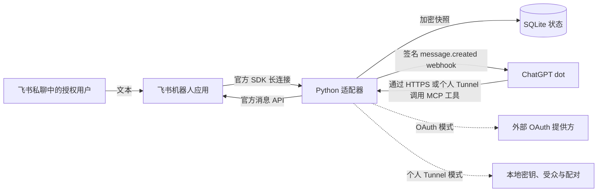

# dots-feishu-adapter

[English](README.md) | [简体中文](README.zh-CN.md)

通过 MCP 工具和 webhook 事件，将 **ChatGPT dots** 连接到一个人的飞书私聊。这个可自行部署的 Python 适配器把授权用户发来的文本转交给 dot，并通过飞书官方 SDK 发送消息或回复。AI 运行在连接的 agent 中；适配器本身不运行模型，也不依赖 OpenClaw。

dots 是本项目的主要适配目标。其他 MCP agent 只有在实现本适配器要求的传输、认证和事件协议时，才可能接入；目前尚未验证它们的兼容性。

## 版本与验证状态

本文以 [PR #1](https://github.com/noir-hedgehog/dots-feishu-adapter/pull/1) 合并后的公开 `main` [`1164cef`](https://github.com/noir-hedgehog/dots-feishu-adapter/commit/1164cef7ddf95fef1dfbc6fb8bf3b815450615be) 为基线，状态核查日期为 **2026-10-07**。源码已发布、离线验证通过与实际部署成功是不同状态。

| 能力 | 公开 `main` | 验证边界 |
| --- | --- | --- |
| 授权私聊文本 → `message.created`；发送和回复文本 | 已包含 | 离线协议、SDK 与持久化测试 |
| OAuth 保护的 HTTP 端点与加密状态 | 已包含 | 使用真实本地 JWT 签名和加密、模拟网络；该版本未测试真实提供方／客户端授权流程 |
| 个人 Secure MCP Tunnel、手动配对与精确回调批准 | 已包含，需显式启用 | 离线认证、绑定、回调与续期覆盖；当前版本未验证真实 dot／Tunnel 部署 |
| 已接收消息收件箱与消息诊断 | 已包含 | OAuth 和个人 Tunnel 的 HTTP 读取回归通过，包括无效／撤销授权 |
| 持久化 `Get` 表情回执 | 已包含，个人 Tunnel 模式下可选启用 | 离线队列、重启、范围限制及官方 SDK builder 测试；真实权限和显示效果需在部署环境验证 |
| 固定测试图片、带链接的富文本消息与非交互卡片工具 | 未包含 | 未发布候选，不属于公开 `main` 已支持的能力 |
| 入站图片／文件／语音附件读取 | 未包含 | 未发布候选，不宣称公开版本支持媒体或语音转写 |

合并后的实现使用锁定依赖通过了 **119 项离线测试，零错误、零跳过**。该版本未执行真实 OAuth 集成、飞书权限／投递／回执、dot 订阅／续期及 Linux 服务部署测试。先前个人部署的历史验证，不能证明所有 dot、租户或 MCP 客户端均兼容。其他 agent 和 Lark 区域部署仍未验证。

“媒体候选”指另一组尚未发布的工作：附件字节传递、文件文本提取，以及固定内容的出站测试消息。收到语音字节不等于完成语音转写，也不证明客户端能够处理音频。这些候选不在本文的已支持接口内，克隆当前 `main` 不会包含它们。

## 架构



飞书长连接负责接收消息，无需公开的飞书事件接收端点。agent 通过 HTTPS MCP 端点或显式启用的 Secure MCP Tunnel 接入；适配器仍需要通过 HTTPS 向批准的 agent 回调地址发送事件。Webhook 确认只表示事件已被接收；发送回复是独立的工具调用。

| 文件 | 职责 |
| --- | --- |
| [`adapter.py`](adapter.py) | 单用户／单私聊限制、事件订阅、回调签名、去重和文本工具；独立运行的服务器仅用于 mock |
| [`deploy/transport.py`](deploy/transport.py) | 无状态 HTTP JSON 绑定、请求元数据和请求头、OAuth 质询与 Origin 检查 |
| [`deploy/auth.py`](deploy/auth.py) | 外部 OAuth JWT 校验及有效令牌自省 |
| [`deploy/store.py`](deploy/store.py) | Fernet 加密的 SQLite 快照，持久化订阅、事件队列、消息关联与发送结果 |
| [`deploy/network.py`](deploy/network.py) | HTTPS 主机白名单、公共 DNS 目标、连接 IP 固定和 TLS 主机名验证；禁止重定向 |
| [`deploy/feishu.py`](deploy/feishu.py) | 官方 `lark-oapi` 接收、发送、回复及投递 worker |
| [`deploy/run.py`](deploy/run.py) | 显式启动真实连接、受保护凭据与本地 HTTP 监听 |
| [`deploy/tunnel.py`](deploy/tunnel.py)、[`deploy/tunnel_runtime.py`](deploy/tunnel_runtime.py) | 可选的个人认证、手动配对、精确回调批准与运行时 |
| [`deploy/handoff.py`](deploy/handoff.py) | 可选的原始回调请求限时等待批准 |
| [`deploy/receipts.py`](deploy/receipts.py) | 持久化异步 `Get` 回执队列，不自动重试结果不明的请求 |
| [`deploy/observability.py`](deploy/observability.py) | 使用允许字段的运维日志与聚合健康指标 |

## `main` 提供的接口

- 事件 `message.created`：仅接受已配置的人类用户在指定私聊中发送的文本。
- `send_message`：向该私聊发送文本。
- `reply_to_message`：回复本适配器已经留存的入站消息。
- `list_received_messages`：按接收顺序读取已留存入站文本，支持 `limit`（1–50，默认 20）、`cursor` 和带时区的 `since`。时间戳表示适配器接收时间，旧记录可能为空。
- `get_message_status`：查询一条留存消息的持久化接收、webhook、回复及 `Get` 回执状态，不返回消息正文或密钥。
- `events/list`、`events/subscribe`、`events/unsubscribe`：发现和管理 webhook 订阅。

两个写入工具都需要 `chat_id`、`text` 和 `idempotency_key`，回复还需要 `message_id`。这些是接口字段名，不是可以从其他部署复制的实际值。工具文本最长 8,000 字符，幂等键最长 128 字符。群消息、其他发送者或会话、机器人发来的消息及非文本消息均被拒绝。读取工具需要 `chat_id`，状态查询还需要 `message_id`。每次 HTTP 调用都经过认证；OAuth 读取使用请求已经验证的主体，个人 Tunnel 读取还会重新检查本地受众与配对。收件箱只读取本地留存状态，不拉取飞书历史消息。

### 客户端兼容性

部署版 HTTP 绑定声明的协议版本为 `2026-07-28`。客户端必须支持其 `server/discover` 流程、每次请求携带的协议／能力元数据、匹配的 `Mcp-Protocol-Version` 与 `Mcp-Method` 请求头，以及工具调用的 `Mcp-Name` 请求头。请求须同时声明接受 JSON 与 event-stream 响应，尽管该实现实际返回 JSON。

仅声明“支持 MCP”不足以保证兼容：`main` 没有 stdio 传输、传统 `initialize` HTTP 握手、SSE 流、sampling 或 elicitation。仅支持工具调用的客户端还需实现 webhook 事件订阅与签名质询流程，才能接收入站消息。其他 MCP agent 与 Lark 区域部署均未验证。部署前请核对目标客户端的协议版本、授权流程和事件能力。

## 本地验证

使用 Python 3.11 或更高版本，并创建隔离环境：

```sh
git clone https://github.com/noir-hedgehog/dots-feishu-adapter.git
cd dots-feishu-adapter
python3 -m venv .venv
.venv/bin/python -m pip install -r requirements.lock.txt
.venv/bin/python verify.py
.venv/bin/python demo.py
.venv/bin/python -m deploy.run
```

`verify.py` 运行离线测试，并把跳过测试视为失败。`1164cef` 的实现已验证 119 项通过、零跳过，覆盖 SDK builder、真实本地加密／JWT 签名、模拟 OAuth 自省、个人 Tunnel 授权、回调、去重、回执与部署配置。Demo 使用 mock。不带 `--run` 运行 `deploy.run` 只检查依赖，不开放端口、不发起网络连接。这些检查不等于建立了真实的飞书／dot 会话。锁定文件记录了测试所用依赖版本；部署前应审查依赖更新。

## 部署与权限

### 共用前提

确认目标 dot／客户端能够连接插件、订阅 webhook 事件并调用工具。适配器无法补上客户端缺少的能力。创建飞书机器人应用，以 SDK 长连接订阅 `im.message.receive_v1`，授予接收目标用户私聊消息及以机器人身份发送／回复所需的权限，并让该用户能够使用应用。具体权限和租户审批／发布要求，应以官方[接收消息](https://open.feishu.cn/document/server-docs/im-v1/message/events/receive)、[发送消息](https://open.feishu.cn/document/server-docs/im-v1/message/create)、[回复消息](https://open.feishu.cn/document/server-docs/im-v1/message/reply)文档和应用控制台为准。应用权限不能替代适配器的单用户／单私聊检查。

文本消息不需要媒体或群历史访问权限。可选的 `Get` 表情回执还需要应用拥有写入消息表情的权限，见[回执配置与限制](ops/RECEIPTS.md)。适配器不会自动授予权限。回执表示适配器已持久化接收消息，不表示 dot 已完成任务。

状态目录仅允许所有者访问（`0700`），数据库文件仅允许所有者读写（`0600`）。重启时保留同一个 Fernet 密钥，新密钥无法解密已有状态。凭据与私有配置应保存在 Git 之外。示例中的值是占位符，请填写自己的标识与批准的端点。

### 方案 A：OAuth（默认）

1. 通过合适的 TLS 反向代理或隧道提供 `/mcp` 与 `/.well-known/oauth-protected-resource`。自带本地 WSGI 监听器不是独立的公网生产服务器。
2. 配置与客户端兼容的外部 OAuth 提供方。本仓库是受保护资源，不是授权服务器。
3. 将 [`deploy/config.example.json`](deploy/config.example.json) 复制为 `deploy/config.local.json`，填写资源 URL、issuer、JWKS／自省 URL、精确授权主体、飞书用户／会话／应用标识、回调主机白名单和允许的浏览器 Origin。
4. 完成配置后显式启动。命令会隐藏输入状态密钥、飞书 App Secret 与独立的自省资源服务器凭据：

   ```sh
   .venv/bin/python -m deploy.run --config deploy/config.local.json --run
   ```

当前实现要求 RS256 JWT，匹配配置的 issuer、资源 audience、精确 subject 与 `feishu:chat` scope。JWT 和自省声明均须有效，且剩余有效期不超过一小时。JWKS 与自省端点必须和 issuer 使用同一主机；自省使用独立 Bearer 凭据，响应必须包含适配器校验的身份、scope 和到期声明。这些是本实现的约束，不是所有 MCP 客户端的通用要求。真实提供方／客户端组合仍需验证。

### 方案 B：个人 Secure MCP Tunnel（显式启用）

参照[个人 Tunnel 配置](ops/PERSONAL-TUNNEL.md)和[服务部署](ops/AVALON.md)。该模式不需要 OAuth issuer。**所有有权使用该 Tunnel 的有效主体都被视为同一个所有者。** 必须确认整个 Tunnel 的受众只有自己；本地密钥不提供多用户身份隔离。

操作者填写飞书 App ID 和 Tunnel ID，并在配置前明确确认这两个目标。占位符会被拒绝，已有目标不能被静默更换，启动配置修复会保留既有 Tunnel ID。Linux systemd 模板提供受保护的凭据文件；旧的 profile／owner 标签仅为状态兼容而保留，并不是部署目标。使用前请审查模板对服务账号和路径的假设。

SDK 连接建立后，600 秒配对窗口会收集私聊候选。操作者必须识别并明确接受目标用户／会话。通过认证的订阅还需在本地批准其精确回调 URL，并通过签名质询。公共 HTTPS／DNS／TLS 限制持续生效，不授予通配符批准。可选的[回调交接试验](ops/HANDOFF-EXPERIMENT.md)允许在 60 秒请求预算内等待最多 45 秒的人工批准；不保证平台取消操作会传递到连接。

配置／启用命令可能写入受保护配置并启动服务。运行前请阅读部署指南；仅克隆仓库或安装依赖不会启用适配器。

### 验证部署

在目标客户端测试签名回调验证、订阅／续期／退订、授权用户的一条消息及一次回复，同时检查重启恢复、越权发送者／会话的拒绝和授权撤销。升级后刷新插件工具目录。`/healthz` 和 `/readyz` 表示本地进程／传输状态；健康端点不能证明 dot 已收到事件、回复已显示或表情已出现。使用[消息诊断与安全日志](ops/OBSERVABILITY.md)区分这些阶段。真实提供方／客户端及生产部署检查与离线测试是不同验证层次。

## 投递、幂等与限制

- **订阅会到期。** TTL 最长一小时。OAuth 订阅还受 JWT／自省中较早到期时间减去 30 秒的限制；剩余有效期不足时拒绝订阅。客户端应在 `refreshBefore` 前续期。签名密钥轮换允许 60 秒重叠窗口。
- **投递持续检查授权。** 每次投递都重新验证授权，包括重启恢复的队列。授权撤销或订阅到期会取消待投递事件。OAuth 模式下，JWKS／自省暂不可用时保留队列，按最长 60 秒的退避间隔等待恢复或到期。退订／撤销无法收回已发出的 HTTP 请求。
- **部署版持久化入站去重。** 已留存的消息 ID 用于拦截重复消息，`eventId` 由消息 ID 派生。消息接收时只为当时有效的订阅入队。不支持 replay cursor 或自动回补历史消息。
- **回调重试有上限。** 最多尝试三次，永久性错误会提前终止。回调端接受事件后、适配器持久化结果前若崩溃，可能再次发送该事件，接收端必须按 `eventId` 去重。重试耗尽后事件可能未送达；不保证恰好一次或最终必达。
- **发送重试复用幂等键。** 已完成的发送再次使用相同键和相同内容，会返回保存的结果；复用同一键更改内容或回复目标会被拒绝。固定的提供方 UUID 有助于处理结果不明的发送，但飞书去重窗口有限。在本地保存结果前崩溃或超时，仍可能需要人工核对。
- **保留策略需要管理。** 已留存 10,000 条消息后拒绝新的入站记录；待投递队列已达 10,000 时也会拒绝准入。每个有效订阅分别入队，因此队列准入检查并非最终队列长度的严格上限。该版本的发送结果／幂等记录没有自动淘汰或配置容量上限，也没有内置保留清理服务。
- **表情回执有容量和重试边界。** 个人 Tunnel 模式下可通过 `received_reaction_enabled` 为新接收消息启用异步 `Get` 回执；最多 100 条待处理、10,000 条已留存回执记录。崩溃或提供方结果不明会进入 `safe_unknown`，不自动重试；权限拒绝会阻止后续尝试，需操作者恢复。不会回溯给旧消息添加表情。
- **存储包含敏感内容。** 加密快照包含消息正文、关联关系、订阅授权与回调密钥。数据库、密钥和备份应分别保护。核心 mock 服务器仅使用内存状态，不能代替部署模式。

## 参考资料

- [飞书官方 Python SDK](https://github.com/larksuite/oapi-sdk-python)
- [插件 MCP Events](https://developers.openai.com/plugins/build/mcp-events)
- [MCP HTTP 传输参考](https://modelcontextprotocol.io/specification/2026-07-28/basic/transports/streamable-http)
- [将插件连接到 ChatGPT](https://developers.openai.com/plugins/deploy/connect-chatgpt)

上文的协议版本和支持边界描述的是仓库中的实现；判断互操作性时，还需查阅目标客户端的当前文档。

## 关键词

ChatGPT dots · 飞书 Feishu · MCP · MCP Events · AI agents · Python · webhooks · 自托管 self-hosted · Secure MCP Tunnel
